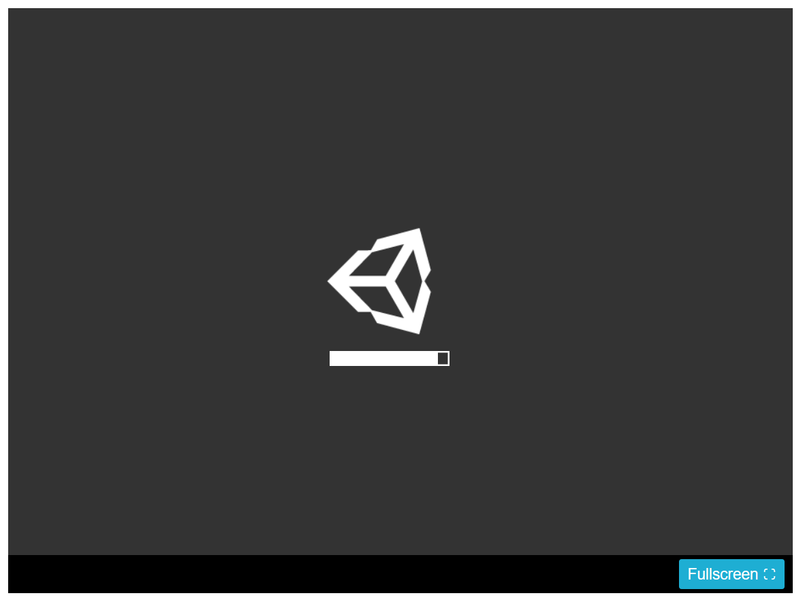
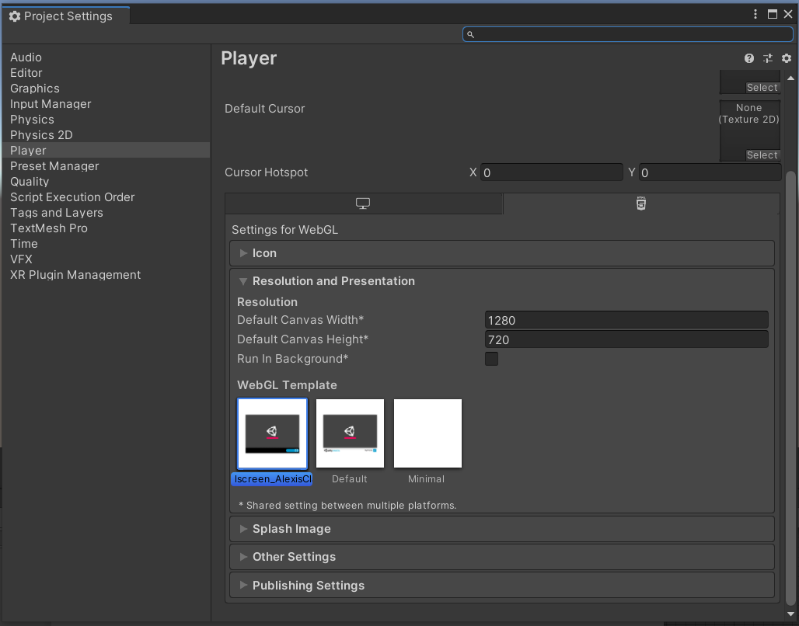

# Unity-WebGLTemplate-Fullscreen
Unity WebGL template based on Default. Has fullscreen button on bottom right. This is intended for portal websites like Itch.io or Newgrounds.com  
Make sure to add 45 pixels to the height when uploading to a portal in order to show the fullscreen button! See intructions below.
  
Tested on Unity 2019.8 LTS

# Preview:  

# Instructions  
1. Download and import "Fullscreen_AlexisClay.unitypackage" in your desired project. It should appear in Assets folder. Do not rename "WebGL Templates"

2. Go to **Edit > Project Settings > Player > HTML5/WebGL tab > Resolution & Presentation** (see screenshot below)  
Select "Fullscreen_AlexicClay" and set your windowed game resolution to your desired size.

3. When uploading to a game portal (Itch.io, newgrounds.com) remember to add 45px to the height in order for the fullscreen button to appear. *Example:*  
Desired windowed game height: **1280x720**  
Game height on Newgrounds: **1280x765**  

